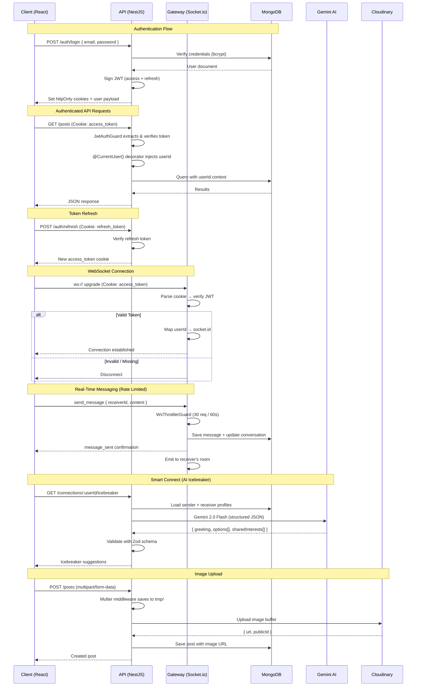

# Vibe — Modern Social Networking Platform

A full-stack social networking application built with **NestJS**, **React 19**, **TypeScript**, and **MongoDB**. Features real-time messaging, a rich profile system, connection management, and a beautiful dark/light theme.

---

## Features

- **Authentication** — Email/password signup & login with JWT (httpOnly cookies), Google OAuth
- **Rich Profiles** — Cover image, avatar, headline, location, skills, experience, education with inline editing
- **Posts & Feed** — Create posts with images (Cloudinary), like, comment (add/edit/delete), infinite scroll
- **Connections** — Send/accept/reject/remove connection requests with real-time notifications
- **Direct Messaging** — Full chat UI with Socket.io, typing indicators, read receipts, conversation list
- **Real-Time Notifications** — Likes, comments, connection requests, messages delivered instantly
- **Dark/Light Theme** — Teal + Warm Gray palette with smooth toggle and system preference detection
- **Responsive Design** — Mobile-first layouts across all pages

## Tech Stack

### Backend
- **NestJS 11** — Modular architecture with decorators & guards
- **Mongoose 9** — MongoDB ODM with TypeScript schemas
- **Socket.io** — WebSocket gateway for real-time features
- **Passport JWT** — Authentication with access/refresh token rotation
- **Cloudinary** — Image upload & management
- **class-validator** — DTO validation

### Frontend
- **React 19** + **TypeScript** — Modern component architecture
- **Vite 7** — Lightning-fast dev server & builds
- **Tailwind CSS v4** — Utility-first styling with CSS variable theming
- **Radix UI** — Accessible primitives (Dialog, DropdownMenu, Tabs, etc.)
- **lucide-react** — Beautiful consistent icons
- **Socket.io Client** — Real-time communication
- **Axios** — HTTP client with credentials
- **date-fns** — Date formatting

## Project Structure

```
├── backend/
│   └── src/
│       ├── main.ts                  # Entry point
│       ├── app.module.ts            # Root module
│       ├── common/                  # Decorators & guards
│       ├── gateways/                # Socket.io WebSocket gateway
│       ├── modules/
│       │   ├── auth/                # Login, signup, Google OAuth, JWT
│       │   ├── users/               # Profile CRUD, search
│       │   ├── posts/               # Feed, likes, comments
│       │   ├── connections/         # Connection requests
│       │   ├── messages/            # Conversations & DMs
│       │   └── notifications/       # In-app notifications
│       └── providers/
│           └── cloudinary/          # Image upload service
│
├── frontend/
│   └── src/
│       ├── main.tsx                 # Entry with providers
│       ├── App.tsx                  # Routes & protected layout
│       ├── context/                 # Session, Theme, Socket providers
│       ├── components/
│       │   ├── layout/              # NavBar, Spinner
│       │   ├── feed/                # PostComposer, PostCard, CommentSection
│       │   └── ui/                  # Button, Card, Dialog, Avatar, etc.
│       ├── pages/                   # Feed, Profile, Network, Messages, Login, Signup
│       ├── hooks/                   # useInfiniteScroll
│       ├── lib/                     # API modules, utilities
│       └── types.ts                 # Shared TypeScript interfaces
```

## Getting Started

### Prerequisites
- Node.js 18+
- MongoDB Atlas cluster (or local MongoDB)
- Cloudinary account (for image uploads)
- Google OAuth Client ID (for social login)

### Backend Setup

```bash
cd backend
npm install
```

Create a `.env` file:

```env
MONGODB_URI=mongodb+srv://<user>:<pass>@cluster.mongodb.net/vibe
JWT_SECRET=your_jwt_secret
JWT_REFRESH_SECRET=your_refresh_secret

CLOUDINARY_CLOUD_NAME=your_cloud_name
CLOUDINARY_API_KEY=your_api_key
CLOUDINARY_API_SECRET=your_api_secret

GOOGLE_CLIENT_ID=your_google_client_id

FRONTEND_URL=http://localhost:5173
PORT=5000
```

```bash
npm run dev    # Start with ts-node-dev (hot reload)
npm run build  # Compile TypeScript
npm start      # Run compiled JS
```

### Frontend Setup

```bash
cd frontend
npm install
```

Create a `.env` file:

```env
VITE_API_URL=http://localhost:5000
VITE_GOOGLE_CLIENT_ID=your_google_client_id
```

```bash
npm run dev    # Start Vite dev server
npm run build  # Production build
```

### Access

- Frontend: [http://localhost:5173](http://localhost:5173)
- Backend API: [http://localhost:5000](http://localhost:5000)

## Design

- **Color Palette**: Teal primary (#0D9488) with warm gray neutrals
- **Dark Mode**: Full dark theme with smooth transitions
- **Typography**: System font stack for performance
- **Animations**: Fade-in, slide-up, scale-in transitions throughout

## Security Architecture



### Key Security Features

| Layer | Mechanism | Details |
|-------|-----------|---------|
| **Auth** | JWT httpOnly cookies | Access (15m) + Refresh (7d) tokens |
| **Passwords** | bcryptjs | Salted hashing, never stored in plain text |
| **API** | `@UseGuards(JwtAuthGuard)` | All protected routes require valid JWT |
| **WebSocket** | Cookie-based JWT verification | On connection, not per-message |
| **Rate Limiting** | `@nestjs/throttler` | HTTP: 5/1s, 30/10s, 100/60s; WS: per-handler |
| **Validation** | `class-validator` + Zod | DTOs whitelist & strip unknown fields |
| **CORS** | Origin-locked | Only `FRONTEND_URL` allowed |
| **Uploads** | Cloudinary | No direct FS access, CDN delivery |

## Author

**Dushyant**

---

> Built with modern web technologies. Designed for a great developer experience and a polished user interface.
